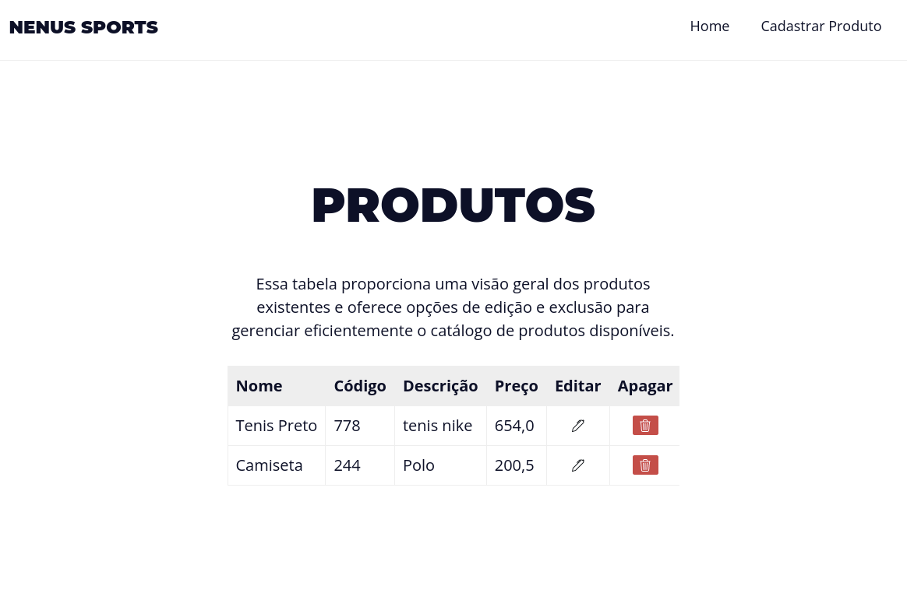
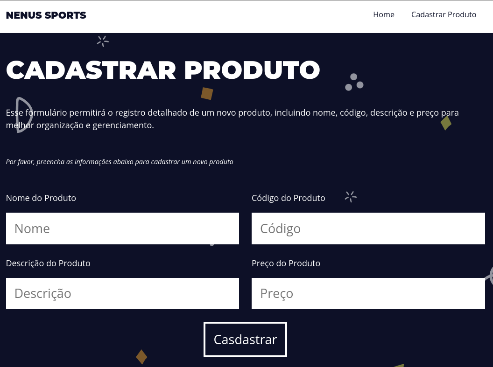
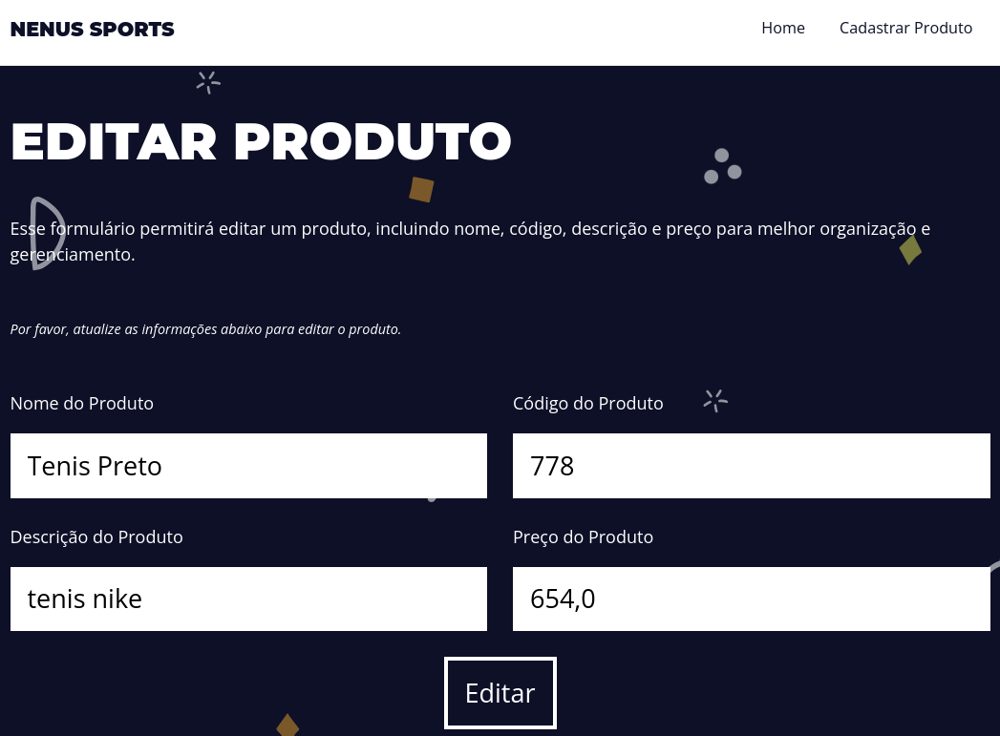

# Desafio de Desenvolvimento - CRUD de Produtos

## Descrição do Projeto

Neste desafio, fui encarregado de desenvolver uma solução para a empresa fictícia Nunes Sports. O objetivo principal é criar um sistema para exibição, criação, edição e deleção de produtos vendidos pela empresa. O desafio inclui a implementação de um CRUD (Create, Read, Update, Delete) de produtos, com ênfase na qualidade de código, organização e boas práticas de desenvolvimento.

## Requisitos

- **Base de Dados:**
  - Criar uma base de dados com uma tabela de produtos, contendo os seguintes campos:
    - Nome do produto
    - Código do produto
    - Descrição do produto
    - Preço do produto

- **Página Web:**
  - A página deve permitir exibir os produtos em uma tabela, criar novos produtos, editar produtos existentes e deletar produtos.
  - Todas as ações realizadas na página devem ser refletidas no banco de dados.

## Tecnologias Utilizadas

Neste projeto, optei por utilizar o framework Django, que é conhecido pela sua simplicidade e eficiência no desenvolvimento web com Python.

- **Imagens do Site:**
  - Imagens do site em funcionamento para visualização rápida.
  
    
    *Legenda: Tabela de produtos exibindo os registros.*

    
    *Legenda: Página de cadastrar um produto.*

    
    *Legenda: Página de edição de um produto específico.*

## Como Iniciar o Projeto

Para iniciar o projeto, siga os passos abaixo:

1. **Clone o Repositório:**
   ```bash
   git clone https://github.com/rodrigoapolo/desafio-everymind.git
   ```

2. **Instale as Dependências:**
   ```bash
   pip install -r requirements.txt
   ```

3. **Configure o Banco de Dados:**
   ```bash
   python manage.py migrate
   ```

4. **Execute o Servidor Local:**
   ```bash
   python manage.py runserver
   ```

5. **Acesse a Aplicação:**
   - Abra o navegador e vá para [http://localhost:8000](http://localhost:8000)

## GitHub Repository

O código fonte deste projeto está disponível no repositório do GitHub. Você pode conferir e clonar o repositório [aqui](https://github.com/rodrigoapolo/desafio-everymind/tree/main).

## Considerações Finais

Agradeço pela oportunidade de participar deste desafio. Estou satisfeito em informar que todos os requisitos foram atendidos integralmente. Estou aberto a feedbacks construtivos e disposto a continuar aprimorando o projeto conforme necessário.